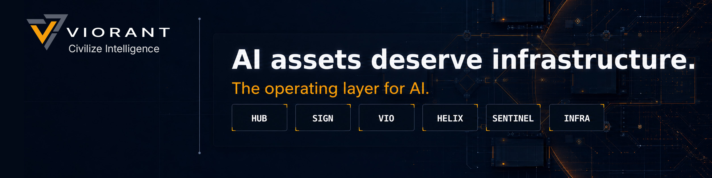

<p align="center">
  
</p>

<h1 align="center">Hi, I'm Vivien Roggero</h1>

<p align="center">
  CEO &amp; Co-Founder of <strong>Viorant</strong> · AI Systems Architect · Based in Taiwan 🇹🇼
</p>

<p align="center">
  <a href="https://viorant.ai">
    
  </a>
  <a href="https://www.linkedin.com/in/vivien-roggero/">
    
  </a>
  <a href="https://x.com/vivienroggero">
    
  </a>
</p>

## What I'm building

AI systems are moving into production faster than the infrastructure needed to control them.

At [Viorant](https://viorant.ai), we build the operating layer above AI models. It gives teams a structured way to version, evaluate, secure, govern, and move their AI assets across models and runtimes.

The goal is practical: make applied intelligence behave more like software.

- **Governable** through policy and controlled change
- **Auditable** through provenance and deterministic records
- **Sovereign** through portable, ownable artifacts
- **Secure** through least privilege and integrity controls
- **Reproducible** through versioning, testing, and evaluation
- **Model-agnostic** by design

Viorant does not build foundation models. We build the infrastructure that makes them operational.

## Why Viorant exists

Software became dependable because engineering teams developed version control, testing, observability, security, and standards. Applied AI still lacks much of that discipline.

Viorant is building the control layer for this new kind of software:

```text
AI assets
   │
   ├── version and evaluate
   ├── sign and prove provenance
   ├── govern and audit
   └── deploy across models and runtimes
```

Our long-term direction is clear: a protocol layer for applied intelligence.

**We Civilize Intelligence.**

## About me

I have spent more than 15 years scaling technology across gaming, e-commerce, fintech, VR, and AI. My work has ranged from building systems used by more than 100 million people to leading cloud migrations, enterprise architecture, and distributed engineering teams.

Today, I am focused on making AI systems governable and useful in the real world.

Outside work, I practice traditional tea ceremony, play the guqin, and write about systems, leadership, and personal transformation.

## Areas I work in

- AI infrastructure and agent architecture
- Enterprise architecture and platform strategy
- Cloud infrastructure, security, and governance
- Distributed engineering leadership
- Model-agnostic AI systems

## Teaching and speaking

- Guest Lecturer — National Cheng Kung University, Taiwan
- Guest Lecturer — President University, Indonesia
- Speaker — Tech in Asia

I speak about AI systems design, agent architectures, technology leadership, and building infrastructure that survives product cycles.

## Book

<p>
  <a href="https://www.amazon.com/Art-Conscious-Transformation-Comprehensive-Self-Awareness-ebook/dp/B0F1YZV43B/">
    
  </a>
</p>

### *The Art of Conscious Transformation*

A practical guide to mindfulness and self-awareness, informed by transformation coaching and behavioral systems.

[View the book on Amazon](https://www.amazon.com/Art-Conscious-Transformation-Comprehensive-Self-Awareness-ebook/dp/B0F1YZV43B/)

## Connect

- [Viorant](https://viorant.ai)
- [LinkedIn](https://www.linkedin.com/in/vivien-roggero/)
- [X](https://x.com/vivienroggero)
- [Personal website](https://vivienroggero.com)

<p align="center">
  <strong>Viorant</strong><br>
  <em>We Civilize Intelligence.</em>
</p>
